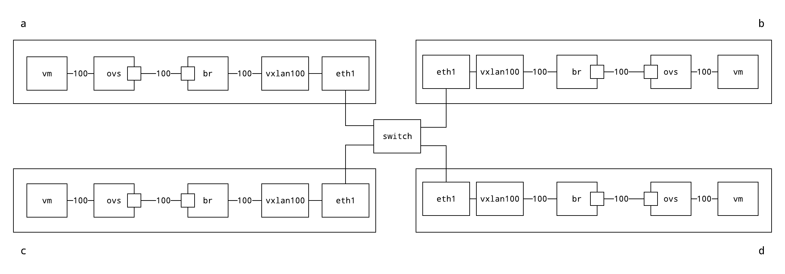

# Merge networking test case

This test case shows how to minimally connect minimega to a VXLAN-based merge
network. There are 4 minimega nodes, each with its own openvswitch bridge.
Additionally a VLAN-filtering Linux bridge is added to each node and a virtual
Ethernet pair connects the OVS and Linux bridges. Attached to the Linux bridge 
is a VXLAN device with proper forwarding set up to push traffic to the other 3 
nodes. This setup would normally be done automatically by the merge EVPN systems, 
but in this case we just set the network up manually. The network plumbing can be 
found in the Ansible script that sets up each node [setup.yml](setup.yml).

The test case uses the commands in [cmds.mm](cmds.mm) to set up two virtual
machines on VLAN 100 on minimega hosts `b` and `d`.  I usually run these 
commands from node `a`. The VLAN filtering on the Linux bridge is setup by 
the Ansible automation to carry this VLAN over VXLAN a priori.

Clearly this example topology is not useful for reality as this is just a flat
L2 network interconnecting the minimega hosts and simply using VLAN tags is
sufficient. The goal of this test case is to demonstrate interconnecting minimega
hosts over VXLAN networks for when the interconnecting testbed network is a 
routed L3 network.

## Running

Note, your machine will need to have a processor that supports nested
virtualization, and this feature must be enabled, otherwise this will not work.
See
[this](https://docs.fedoraproject.org/en-US/quick-docs/using-nested-virtualization-in-kvm/)
for details. You only need to make sure that the
`/sys/module/kvm_[intel|amd]/parameters/nested` is enabled. Raven will take care
of the rest. This test case requires [raven](https://gitlab.com/rygoo/raven).
This test case can probably be moved to a miniception setup at some point, but my
mini-fu is not that good yet.

- use `run.sh` to setup the topology
- ssh into each of the nodes (`eval $(rvn ssh <node>)` as root) and run minimega 
  using `sudo /tmp/mm/tests/raven/merge-net/launch-minimega.sh`.
- run the commands from `cmds.mm` in the minimega console on node `a`.
- start [miniweb](http://minimega.org/articles/miniweb.article) on node `a`,
  (note that this must be run from `/tmp/mm` to work so miniweb has access to
  the web files it needs to serve)
- use the web interface to get a VNC console for VMs `v0` and `v1`.
- login to each VM using u: `rvn`, p: `rvn`.
- add IP addresses on the same subnet to `eth0` in VMs `v0` and `v1`.
- ensure that the VMs can indeed talk
- use tcpdump on the minimega hosts to verify that the traffic is actually 
  transiting the VXLANs
